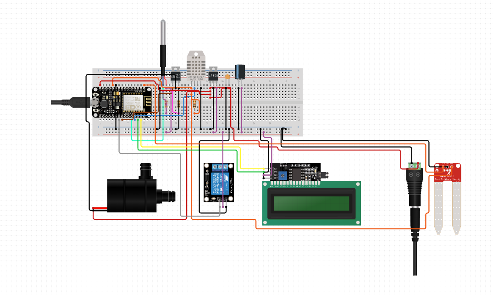

# Motivation
As the global population continues to surge and the climate becomes increasingly unstable, agriculture is under immense pressure to meet growing food demands. Currently, traditional agricultural practices make up a majority of the agriculture industry worldwide. However, it is unsuitable for meeting the rising global demands for food security and environmental sustainability; the intensive manual labor and the reliance on traditional knowledge produce ineffective crop yields and often waste natural resources, posing a significant threat to food security and sustainability. As a result, it is reasonable to redirect our attention to automated, data-driven technological solutions capable of addressing these concerns. 

## Smart Farming
Agriculture 4.0, also known as smart farming, aims to address these issues. Smart farming has become increasingly popular recently as it offers a pathway to reduce manual labor and provide data-driven insights into agriculture, offering more productive yields and effective resource management. It uses various tools such as temperature sensors, robots, and GPS technologies to revolutionize agriculture. The promising outlook of smart farming hopes to mitigate the risk of food security and environmental degradation globally. 

## Description

This small project aims to demonstrate smart farming at a smaller and more accessible scale. It is part of my ongoing research of smart farming and the nature-technology interdisciplinary. This mini project uses a microcontroller equipped with temperature, humidity, and soil moisture sensors to automate a water-pumping mechanism for irrigation and humidity control. The project can easily be replicated by obtaining the same components. The goal of this project is to educate others on the compelling benefits that technology can have on nature.

## Materials

- NodeMCU ESP8266 V3
- Capacitive Soil Moisture Sensor v2.0
- Digital Thermometer (DS18B20)
- Humidity Sensor (DHT11)
- LCD Display 16x2
- I2C LCD Module
- Relay Module 12V 1 channel
- DC Mini Submersible Water Pump

## Schematic
Sample schematic (not the same as one used)

